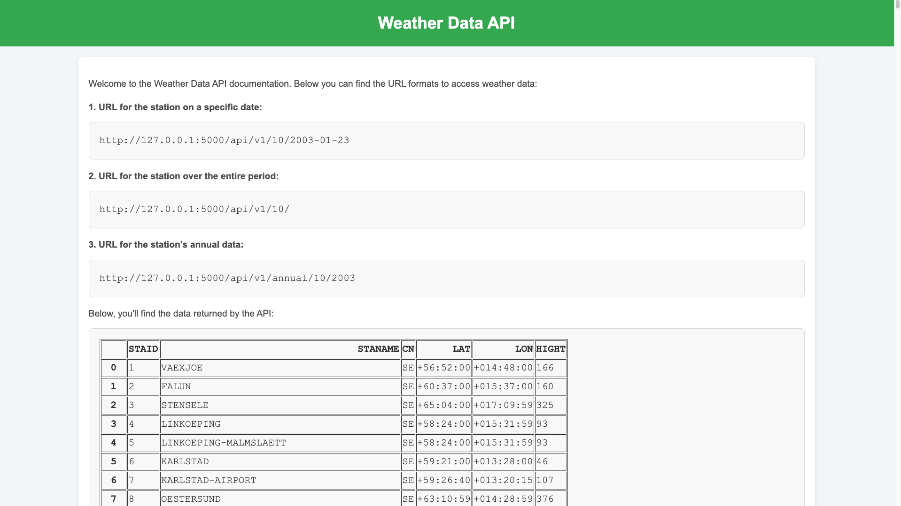

# Weather Data API

This is a simple Flask application that provides access to weather data from various stations. The API allows you to retrieve temperature data for specific stations, dates, and annual data, as well as displaying a list of stations on the homepage.

## Features

- **Homepage**: Displays a list of stations.
- **API Endpoints**:
  1. **Get temperature for a specific station and date**:
     - URL format: `/api/v1/<station>/<date>`
     - Example: `/api/v1/10/2003-01-23`
  2. **Get all data for a specific station**:
     - URL format: `/api/v1/<station>/`
     - Example: `/api/v1/10/`
  3. **Get annual data for a specific station and year**:
     - URL format: `/api/v1/annual/<station>/<year>`
     - Example: `/api/v1/annual/10/2003`

## Requirements

- Python 3.x
- Flask
- Pandas
